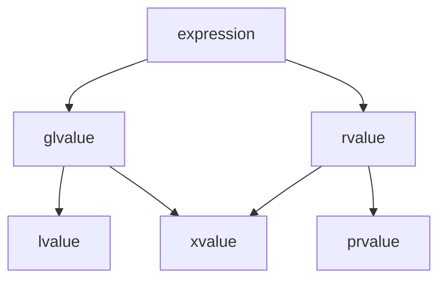

---
title: C++值类别和delctype
publishDate: 2025-02-13
description: 'C++值类别和delctype'
tags:
  - C++
---

每个 C++ 表达式具有两个独立的属性：类型 (type) 和值类别 (value category)。每个表达式都有某种非引用 (non-reference) 类型，并且每个表达式必定属于三种主要值类别之一：prvalue、xvalue 和 lvalue。
- lvalue (左值): 表示一个对象身份, 可以获取地址，T&
- prvalue (纯右值): 用于初始化对象或计算操作数的值，T
- xvalue (将亡值): 表示资源可以被重用的对象，T&&


**以下是个人的理解**：  
左值(lvalue)就是具名的有地址的"值""，纯右值(prvalue)就是临时的无地址的"值"。但是有时候希望让纯右值具名且延长纯右值生命周期，这时候就通过`std::move`转换为将亡值(xvalue)  
直观的例子
- 对于函数`func(A& a)`因为函数内部可能修改`a`，所以不能传纯右值，但是可以通过`std::move`传入将亡值;
- 对于函数`func(const A& a)`因为函数内部不会修改`a`，所以可以传入纯右值;

## 值类别

### 不同值类别到底是什么

- **glvalue**  
- **rvalue**： prvalue+xvalue  
- **lvalue**：可以取得到地址的具体对象的抽象表达。值得注意的是，lvalue 可是一个对象名，也可能是一个表达式。
- **xvalue** ：通过右值引用产生的值，能延长引用前纯右值的生命周期。
- **prvalue**：初始化 T 对象的抽象表达。不对应有名对象。不能取到其地址。

来点例子比如
```cpp
int x = 5;
```
这其中字面量 `5` 为 prvalue，`x` 为 lvalue。

### 不同值类别能干什么和不能干什么

**glvalue**：  
**rvalue**：
- **不能**取地址
- **不能**作为内置赋值运算符和复合赋值运算符的左操作数
- 初始化常量左值引用 (const T &)
- 初始化右值引用 (T &&)  
	能延长临时对象的生命周期，知道 T&& 的作用域结束  
- 优先会绑定到右值引用函数重载上  
**lvalue**：
- 取地址
- 可修改的左值可以用作内置赋值运算符和复合赋值运算符的左操作数  
	典型比如 = 运算符的左边必须是一个可修改的左值
- 初始化左值引用 (T&)  
**xvalue**:
- 和 glvalue 以及 rvalue 相同  
**prvalue**:
- 与 rvalue 相同
- prvalue 不能具有抽象类类型或其数组。  
	这句话挺抽象的，其实就是不能创建抽象类型的实例给 T

### 不同类别表达式的具体形式

具体类别可见[Value categories - cppreference.com](https://en.cppreference.com/w/cpp/language/value_category#xvalue)

## delctype 返回值类别(Value Category)

### delctype 计算模式

1. 变量decltype:
	- 用于未加括号的标识符
	- 保持声明时的精确类型

2. 表达式decltype:
	- 用于其他所有表达式
	- 根据表达式的值类别确定引用限定符  
**特别注意**：如果一个对象名被括号括起来，将会被视为左值表达式，因此`delctype(x)`和`delctype((x))`通常是不同类型

### delctype 返回值类别规则

变量delctype：T

表达式delctype
- 左值 (lvalue) 表达式 → T&
- 纯右值 (prvalue) 表达式 → T
- 将亡值 (xvalue) 表达式 → T&&

## Reference

[Value categories - cppreference.com](https://en.cppreference.com/w/cpp/language/value_category#xvalue)  
[\[expr.prop\]](https://timsong-cpp.github.io/cppwp/n4861/expr.prop#fig:basic.lval)  
[C++ value categories and decltype demystified](https://www.scs.stanford.edu/~dm/blog/decltype.html)
